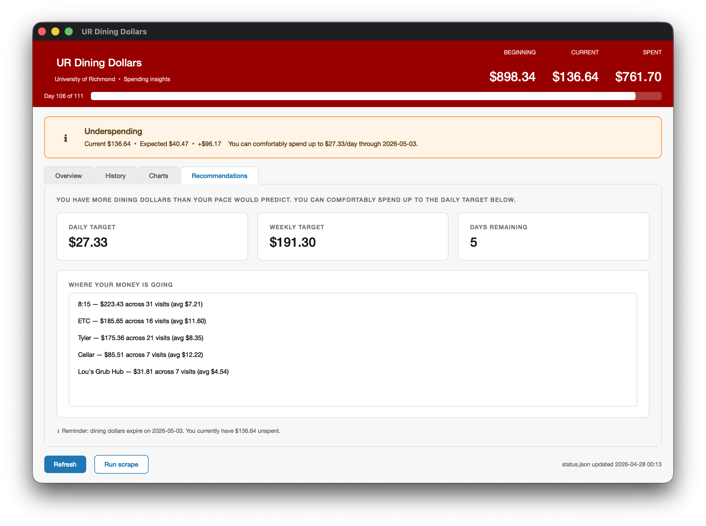
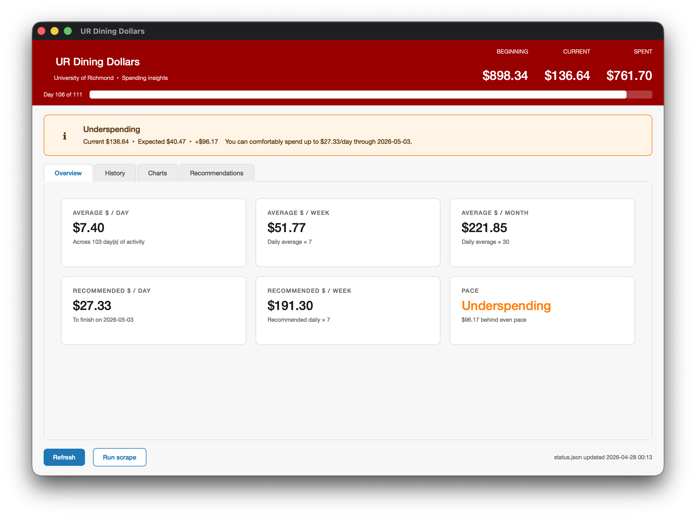
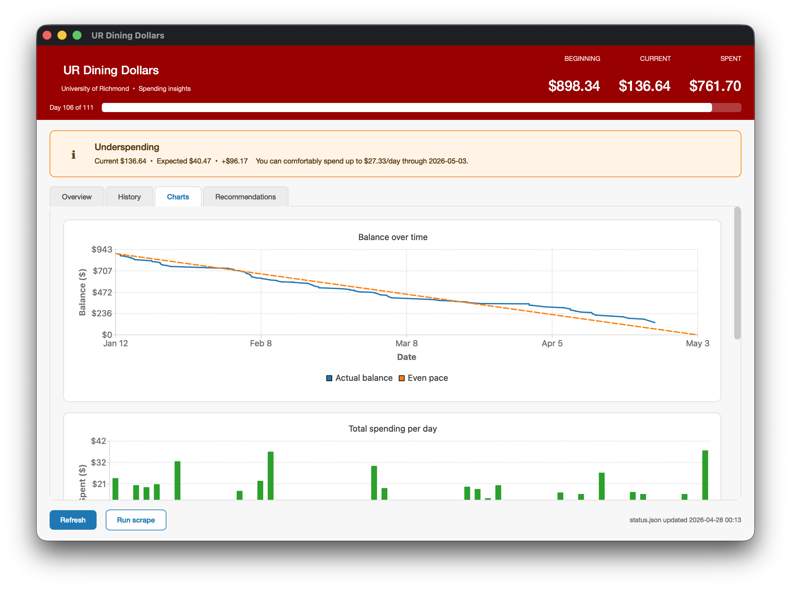
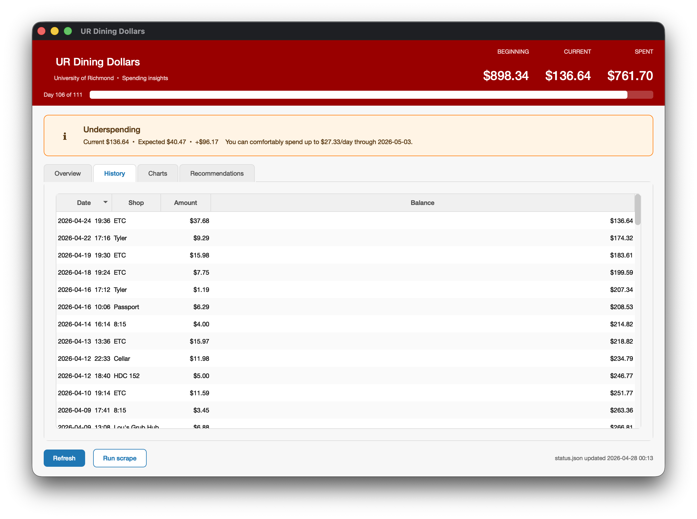
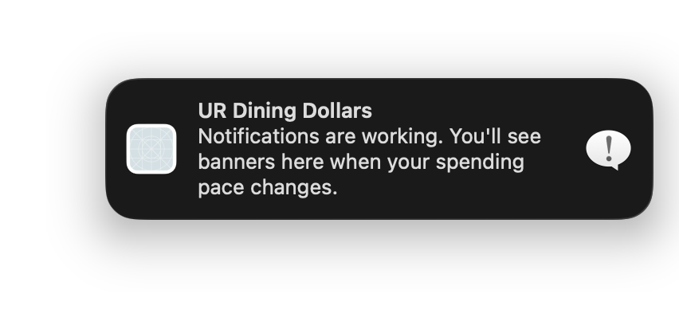
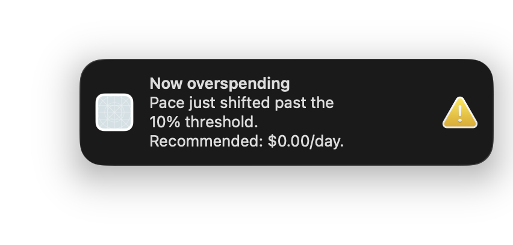

# 240_final_project

Scrapes University of Richmond One Card spending history, processes it with C++, and visualizes balance and daily spending over time.
The program determines users' dinning dollar spending status and provide
notification and recommendations. 

## Team Member
- Yushiro Murakami
- Tony Wang


## Requirements

- Python 3 + `make`
- CMake 3.14+ and a C++17 compiler (install via `brew install cmake`)
- QT 6

## Setup (one time)

```
make setup
```

This creates a Python virtual environment, installs all dependencies,
installs the Playwright Chromium browser, and compiles the C++ analyzer.

## Run the pipeline

```
make run
```

## Desktop UI (Qt 6)

After installing QT:

```
make ui
```

A  dashboard built on Qt 6 + QtCharts surfaces

### Install Qt 6 (one-time)

The dashboard depends on **Qt 6** with the **Qt Charts** module.

#### macOS

```
brew install qt
```

If you don't have Homebrew, install it from <https://brew.sh> first. The
build picks up `brew --prefix qt` automatically

#### Windows

1. Download the **Qt Online Installer** from
   <https://www.qt.io/download-qt-installer> (free for open-source use; sign
   in with a free Qt Account when prompted).
2. In the installer, select:
   - **Qt → Qt 6.7** (or any 6.x ≥ 6.5)
     - **MSVC 2019 64-bit** (or **MinGW 64-bit** if you don't have Visual Studio)
     - **Qt Charts** (under *Additional Libraries*)
   - **Developer and Designer Tools → CMake** and **Ninja** (only if you
     don't already have them).
3. Also install **Visual Studio 2019/2022 Build Tools** (free) for the MSVC
   compiler if you chose the MSVC kit.
4. Note the install path, e.g. `C:\Qt\6.7.0\msvc2019_64`.

Then build from a **Developer Command Prompt** (or Git Bash):

```
cmake -S ui -B ui\build -DCMAKE_PREFIX_PATH="C:\Qt\6.7.0\msvc2019_64" -DCMAKE_BUILD_TYPE=Release
cmake --build ui\build --config Release
ui\build\Release\dining_ui.exe
```

(`make ui` works on Windows too if you run it inside Git Bash, MSYS2, or
WSL.)

### Notifications

The dashboard installs a small `$` icon in your menu bar (macOS) or system
tray (Windows). It re-checks `status.json` every 5 minutes and fires a native
banner notification when your pace classification changes (on track →
overspending, etc.). On first launch, allow notifications when the OS prompts
you — otherwise alerts will only appear in-window.

## Exmple Usage and Screenshots














## Clean up generated files

```
make clean
rm -rf .claude build ui/build analyzing/build python/.venv ~/Library/Caches/ms-playwright
```
