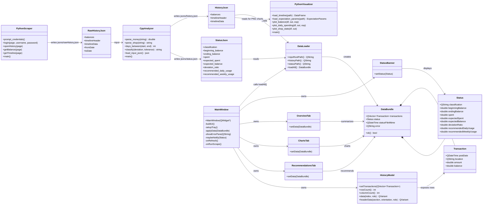

# UML Diagram of System Design

```mermaid
classDiagram
    direction LR

    class PythonScraper {
        +prompt_credentials()
        +login(page, username, password)
        +openHistory(page)
        +getBalance(page)
        +getTimeline(page)
        +main()
    }

    class RawHistoryJson {
        +balances
        +timelineHeader
        +timelineData
        +fromDate
        +toDate
    }

    class CppAnalyzer {
        +parse_money(string) double
        +parse_shop(string) string
        +days_between(start, end) int
        +classify(deviation, tolerance) string
        +load_input_json() json
        +main()
    }

    class HistoryJson {
        +balances
        +timelineHeader
        +timelineData
    }

    class StatusJson {
        +classification
        +beginning_balance
        +ending_balance
        +spent
        +expected_spent
        +expected_balance
        +deviation_ratio
        +recommended_daily_usage
        +recommended_weekly_usage
    }

    class DataLoader {
        +repoRootPath() QString
        +historyPath() QString
        +statusPath() QString
        +loadAll() DataBundle
    }

    class DataBundle {
        +QVector~Transaction~ transactions
        +Status status
        +QDateTime statusFileMtime
        +QString error
        +ok() bool
    }

    class Transaction {
        +QDateTime postDate
        +QString location
        +double amount
        +double balance
    }

    class Status {
        +QString classification
        +double beginningBalance
        +double endingBalance
        +double spent
        +double expectedSpent
        +double expectedBalance
        +double deviationRatio
        +double recommendedDailyUsage
        +double recommendedWeeklyUsage
    }

    class MainWindow {
        +MainWindow(QWidget*)
        -buildUi()
        -setupTray()
        -applyData(DataBundle)
        -showErrorPane(QString)
        -maybeNotify(Status)
        -onRefresh()
        -onRunScrape()
    }

    class StatusBanner {
        +setStatus(Status)
    }

    class OverviewTab {
        +setData(DataBundle)
    }

    class ChartsTab {
        +setData(DataBundle)
    }

    class RecommendationsTab {
        +setData(DataBundle)
    }

    class HistoryModel {
        +setTransactions(QVector~Transaction~)
        +rowCount() int
        +columnCount() int
        +data(index, role) QVariant
        +headerData(section, orientation, role) QVariant
    }

    class PythonVisualizer {
        +load_timeline(path) DataFrame
        +load_expectation_params(path) ExpectationParams
        +plot_balance(df, out, exp)
        +plot_daily_spending(df, out, exp)
        +plot_shop_stats(df, out)
        +main()
    }

    PythonScraper --> RawHistoryJson : writes jsons/rawHistory.json
    RawHistoryJson --> CppAnalyzer : input
    CppAnalyzer --> HistoryJson : writes jsons/history.json
    CppAnalyzer --> StatusJson : writes jsons/status.json
    HistoryJson --> DataLoader : reads
    StatusJson --> DataLoader : reads
    DataLoader --> DataBundle : creates
    DataBundle *-- Transaction
    DataBundle *-- Status
    MainWindow --> DataLoader : calls loadAll()
    MainWindow --> StatusBanner : owns
    MainWindow --> OverviewTab : owns
    MainWindow --> ChartsTab : owns
    MainWindow --> RecommendationsTab : owns
    MainWindow --> HistoryModel : owns
    StatusBanner --> Status : displays
    OverviewTab --> DataBundle : summarizes
    ChartsTab --> DataBundle : charts
    RecommendationsTab --> DataBundle : recommends
    HistoryModel --> Transaction : exposes rows
    HistoryJson --> PythonVisualizer : reads for PNG charts
```